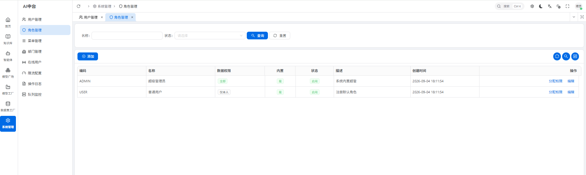
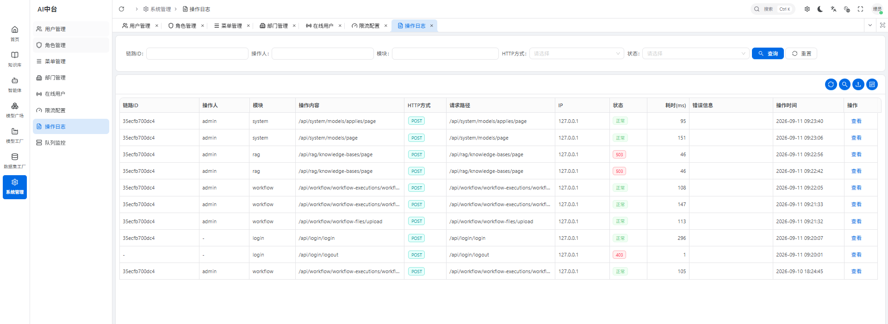
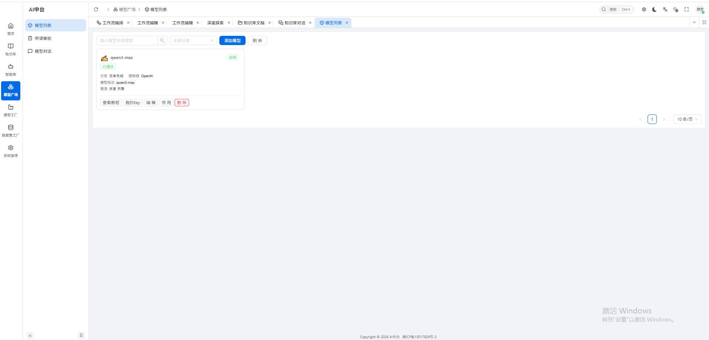
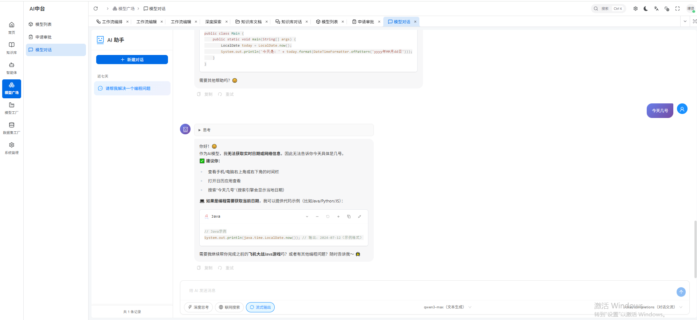
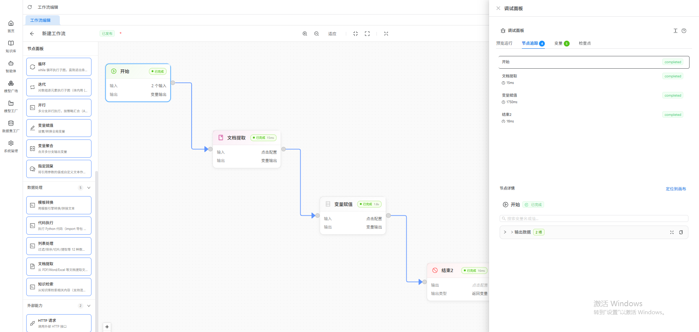

# 🐉 DRAGON-AI — AI Middle Platform

> **If you find this project useful, please give it a Star. Thank you.** ⭐
> [](https://github.com/Anton2025-11-06/DRAGON-AI)

> WeChat：

> Online：http://47.111.117.95:12345   viewer/viewer

> This README is kept in sync with the code: **everything marked "Done" actually runs; treat
> "In Progress" and "Planned" as unavailable**.
> [中文](README.md) / English.

---

## 1. Capabilities

### 1.1 Enterprise RBAC & operations foundation

| Capability | Notes |
|---|---|
| User / role / menu / button permission points | A permission point *is* a menu row (`menu_type=3`); one dataset drives both UI visibility and backend `@has_permission`. ADMIN bypasses checks |
| Departments & data scope | Five data scopes (all / dept & below / own dept / self only / custom department set); a dept manager manages members of their own dept |
| Authentication | JWT signature + Redis session (`login:{jti}`); logout revokes immediately; hashed password storage; brute-force rate limit on login |
| Audit log | End-to-end `x-trace-id`, sensitive fields masked automatically, one request traceable across every row it touched |
| Online users / ARQ monitor | Force-logout sessions; worker liveness, queue backlog, split count adjustable at runtime |
| Rate-limit config centre | Per-module-bucket QPS & daily quota, atomic Redis counters, hot reload in the gateway |




### 1.2 AI model gateway & model square

- **OpenAI-compatible entry** `POST /api/model`: api-key auth → model consistency check → QPS + daily quota → vendor call → streaming SSE / plain JSON
- **12 model capability types × 3 providers** (OpenAI-compatible / DashScope / Zhipu): text generation, embeddings, rerank, image & video understanding, OCR, text-to-image, text-to-video, image-to-video, text-to-audio, audio-to-text, ...
- **Capability flags per model**: `supports_stream` / `supports_thinking` / `supports_function_call` are registered in model management; anything not registered is never sent to the vendor
- **Full model lifecycle**: onboard (direct / indirect, suffix rewrite) → apply → approve → issue/revoke API key → one-click connectivity test → online/offline toggle (Redis cache refreshed)
- **Model playground**: multi-model chat in the browser with streaming, reasoning chain and tool-call results




### 1.3 Workflow / agent orchestration

- **Visual canvas**: `{nodes, edges}` editing, draft / publish / version snapshot / rollback / duplicate, strict graph validation before publish (reachability, ports, required params, cycles)
- **21 node types**: boundary (START/END), AI (LLM / question classifier / parameter extractor), control (IF_ELSE / LOOP / PARALLEL / variable assigner / aggregator / reply / **approval**), data (template / code / list operator / document extractor / knowledge retrieval), external (HTTP / tool / MCP tool / **sub-workflow**)
- **The execution contract has exactly three concepts**: `executionId` (the whole identity of one run), `pendingApprovals` (approvals currently owed), `submit` (the only action on the only entry point). First run, continue, re-run and answering an approval are all the same `POST /workflow-executions/submit`
- **Human approval (nested)**: an approval node suspends at the node boundary; snapshots persist and recovery works across processes; a sub-workflow's approval bubbles up to the parent run, answered with a one-shot `approvalToken`
- **Real-time events**: WebSocket (drives the preview page synchronously) + SSE (third-party long connection) + DB replay; every frame carries `pauseGeneration` so generations never interleave
- **Reliability**: pause TTL watchdog, per-node timeout, cancellation, global job idempotency (duplicate enqueue is rejected)
- **Multi-turn memory**: LLM history scoped to one `executionId`, selectable as this node / chosen nodes / whole workflow, with drop or auto-compress strategies when over the limit
- **Function calling**: an LLM node can mount tools / MCP connections / sub-workflows; their parameter schemas are read at execution time and the model decides whether and how to call them
- **Resource centres**: skills (SKILL.zip upload / preview / inline edit / enable-toggle), tools (dynamic Python functions in a sandbox), MCP connections (`tools/list` discovery), workflow templates (seeded on first start)
- **Serving externally**: API key metadata (quota / expiry / enable) plus four open endpoints (submit / status / SSE / cancel)



### 1.4 Execution engine & infrastructure

- **Async execution**: arq + Redis sharded queues (`workflow_queue:split_{N}`), routed by `crc32(executionId)` so one run always lands on the same shard; horizontally scalable
- **Storage abstraction**: one `StorageBackend` with a local-directory and an Aliyun OSS implementation (official SDK V2 async client), switched by the Nacos `storage:` section or env vars; **diskless** — the backend only moves bytes, document parsing happens in memory
- **Registration & configuration**: Nacos owns every environment difference (database / Redis / storage / vector store); a service registers and pulls config on startup, no connection string is hard-coded
- **Observability**: loguru plus a home-grown `x-trace-id` that survives gateway → service → worker

---

## 2. Development progress

### ✅ Done

| Module | Service | Content |
|---|---|---|
| System management | `service_system` :9001 | Full RBAC, model square & approvals, API keys, audit log, online users, rate-limit config, ARQ monitor, gateway route config |
| Login / register | `service_login` :9004 | Login / register / logout / token refresh (sliding expiry), JWT + Redis session |
| Business gateway | `service_gateway` :18000 | Route forwarding (Nacos discovery), JWT auth, module rate limiting, audit log, trace-id, API-key translation |
| AI model gateway | `service_gateway` | `/api/model` OpenAI-compatible entry, 12-type dispatch, streaming passthrough, two-layer quotas |
| Workflow orchestration | `service_workflow` :9003 | Canvas, 21 node types, submit contract, nested approval, SSE/WS, snapshot recovery, timeouts & watchdog, memory, tool/MCP/skill/sandbox, templates, API-key serving |
| Async execution | `arq_tasks` | Sharded queues, multi-process workers, health reporting, idempotent enqueue |
| Storage abstraction | `common_storage` | Local + Aliyun OSS, presigned URLs, diskless byte transfer |
| Front end | `ui-ai` :5666 | vben v5 SPA covering every module above |

### 🔄 In progress (code exists, not a usable capability)

| Module | Status |
|---|---|
| Knowledge base `service_rag` :9002 | Tables and the kb / retrieval skeletons exist, but the `common_rag` helpers (chunking / keywords / RRF) and `arq_tasks.tasks.vectorize` are not implemented — **the service currently fails on import**. The Milvus client layer is ready |
| Knowledge retrieval node | The `KNOWLEDGE_RETRIEVAL` executor is implemented but greyed out in the node palette until the knowledge base lands |
| Harness agent | Skill / tool / MCP centres are usable inside the workflow service; the standalone autonomous planning loop is not, ports :9005 / :9006 and constants are reserved |

### 📋 Planned (empty skeletons only)

`service_datasets`, `service_train`, `service_inference`, `service_eval_model`, `service_notebook`.
These reserve a package directory, a rate-limit bucket name and a gateway alias — nothing else. Do not read them as features.

---

## 3. Deployment

### 3.1 Requirements

| Dependency | Version | Purpose |
|---|---|---|
| Python | 3.11+ | Back end |
| Node.js / pnpm | 20.12+ / 10+ | Front-end build |
| MySQL | 8.x (5.7 works) | Business data |
| Redis | 5+ (7.x recommended) | Sessions / rate limits / queues / config cache |
| Nacos | 2.x | Registry + config centre, **mandatory** — every environment difference lives there |
| Aliyun OSS | optional | Enabled with `storage.type=oss` |
| LibreOffice | optional | Only needed to parse legacy `.doc/.ppt` in workflow nodes |

### 3.2 Initialising a fresh environment (four steps)

**1) Create the schema and seed data** — one file covers it: 24 business tables plus role / admin / department / menu / button permission seeds.

```bash
# To use another database name, edit the two lines in PART 0 (CREATE DATABASE + USE)
# The file must run over a single connection (menu seeds use @session variables for parent ids);
# the mysql CLI satisfies this naturally
# Safe to re-run: CREATE TABLE IF NOT EXISTS, and every seed is INSERT IGNORE, so a rerun never
# resets a changed password or menu ordering
mysql --default-character-set=utf8mb4 -h <host> -u root -p < sql/v2_init.sql
```

**2) Create the Nacos configs**, one per `data_id` = service name: `service_system` / `service_login` /
`service_workflow` / `service_gateway` / `arq_workflow`. Copy `sql/init_nacos.yaml` and change the
connection details.

> ★ The `arq_workflow` section must contain `redis.url`, and it must point at the same Redis the
> `service_workflow` producer uses — otherwise jobs are enqueued where nobody consumes them.
> The `storage:` section is only needed when workflow files go to object storage; without it the
> local directory backend is used.

**3) Start the back end** — four services plus the worker; see 3.3 (bare metal) or 3.4 (containers).

**4) Start the front end** — `pnpm build:antd` produces static files; serve them with nginx and proxy
`/api` to the gateway. With the front-end image from 3.4 you only pass `GATEWAY_URL`.

Initial account `admin / Admin@123` — **change the password right after the first login**.

For an existing database that has to catch up on columns and permission points, run the incremental
scripts under `sql/old/` one by one; each header states which table it alters.
`sql/old/new_init_.sql` and `sql/old/workflow_schema.sql` have been superseded by `v2_init.sql` and
are kept only as provenance.

### 3.3 Running locally

```bash
pip install -r requirements.txt

python -m service.service_login.login          # :9004
python -m service.service_system.system        # :9001
python -m service.service_workflow.workflow    # :9003
python -m service.service_gateway.gateway      # :18000
python -m arq_tasks.run_workers -n 4 -p 1      # arq workers: 4 processes on shard 1

cd ui-ai && pnpm install && pnpm dev:antd      # :5666 (vite already proxies /api → 127.0.0.1:18000)
```

### 3.4 Docker

Two images — one back end, one front end. **Which process a container runs is decided by injected
environment variables**:

```bash
# Build (both use the repository root as context)
docker build -f docker/Dockerfile     -t dragon-ai-backend:latest .
docker build -f docker/Dockerfile.ui  -t dragon-ai-ui:latest      .

# One service: SERVICE_NAME selects the process
docker run -d --name wf --init -p 9003:9003 \
  -e SERVICE_NAME=service_workflow \
  -e NACOS_ADDR=10.0.0.9:8848 -e NACOS_NAME=nacos -e NACOS_PASSWD=xxx \
  -e service_workflow_port=9003 -e WORKERS=4 \
  dragon-ai-backend:latest

# arq worker: same image, different SERVICE_NAME
docker run -d --name arq --init \
  -e SERVICE_NAME=arq_workflow -e NACOS_ADDR=10.0.0.9:8848 \
  -e ARQ_WORKERS=4 -e SPLIT_NUMBER=1 \
  dragon-ai-backend:latest

# Front end: GATEWAY_URL tells nginx where to send /api
docker run -d --name ui --init -p 8080:80 \
  -e GATEWAY_URL=http://10.0.0.9:18000 \
  dragon-ai-ui:latest
```

All of them at once:

```bash
cp docker/.env.example docker/.env   # fill in NACOS_ADDR
docker compose -f docker/docker-compose.yml up -d --build
# open http://<host>:8080
```

| Variable | Purpose | Default |
|---|---|---|
| `SERVICE_NAME` | Which process the container runs: `service_login` / `service_system` / `service_gateway` / `service_workflow` / `service_rag` / `arq_workflow` | none (required) |
| `NACOS_ADDR` `NACOS_NAME` `NACOS_PASSWD` `NACOS_NS_ID` | Registry and config centre | none |
| `<service_name>_port` | Override the listening port (lower-case service name — that is the format the code reads) | per-service default |
| `WORKERS` | gunicorn worker count per micro-service | 4 |
| `ARQ_WORKERS` / `SPLIT_NUMBER` | worker process count / queue shard this instance consumes | 4 / 1 |
| `GATEWAY_URL` / `LISTEN_PORT` | Front-end container: gateway address / listening port | `http://127.0.0.1:18000` / 80 |

**All start-up scripts live in `scripts/`** — the container and a bare-metal run use the same file:

| Script | Notes |
|---|---|
| `scripts/docker-entrypoint.sh` | Single container entry, dispatches on `SERVICE_NAME` |
| `scripts/run_service.sh` | gunicorn + `uvicorn.workers.UvicornWorker`, 4 workers per service by default. Production flags: `--backlog 4096`, `--timeout 120`, `--graceful-timeout 30`, `--max-requests 50000 (+jitter)`, `--worker-tmp-dir /dev/shm`, `--proxy-headers --forwarded-allow-ips '*'`, logs to stdout |
| `scripts/run_arq_workflow.sh` | Starts N arq workers and translates `docker stop`'s TERM into the INT path that the graceful shutdown branch handles |
| `scripts/run_ui.sh` | Renders `GATEWAY_URL` into the nginx site config and runs nginx in the foreground |

### 3.5 Kubernetes

The `k8s/` directory is reserved; no manifests yet.

---

## 4. Tech stack

| Layer | Choice |
|---|---|
| Back end | Python 3.11 · FastAPI (fully async) · SQLAlchemy 2.0 + aiomysql · Pydantic v2 |
| Process & deploy | gunicorn + UvicornWorker · Docker · Nacos (registry / config centre) |
| Data & middleware | MySQL 8.x · Redis (sessions / rate limits / cache / arq queues) · Aliyun OSS · Milvus (client layer ready) |
| Async tasks | arq 0.28 with Redis sharded queues, multi-process scaling |
| Communication | httpx global connection pool (HTTP/2) · WebSocket · SSE (sse-starlette) |
| Model access | One `openai_impl` / `dashscope_impl` / `zhipu_impl` per capability, dispatched by `common_model.entry` on (capability, provider) |
| Agents | Official MCP Python SDK · sandboxed process isolation (psutil) · code nodes share the same sandbox; `deepagents` is declared as a dependency but the planning loop is not implemented |
| Retrieval | pymilvus client layer · rank-bm25 keyword scoring (knowledge base not wired up yet; document parsing already reused by the workflow side) |
| Observability | loguru + home-grown `x-trace-id` (OpenTelemetry dependencies declared, not yet wired into code) |
| Front end | Vue 3.5 · TypeScript · Vite · vben v5 (pnpm + turbo monorepo) · ant-design-vue · Vue Flow canvas · CodeMirror/Monaco |
| AuthZ/AuthN | JWT + Redis session · dual-channel API key · RBAC permission points |

---

## 5. Project layout

```
├── common/                       # Shared layer, no business logic
│   ├── common_app/               #   create_app bootstrap factory (lifespan + middleware + errors)
│   ├── common_nacos/             #   Nacos registration, discovery and config pull
│   ├── common_middleware/        #   RequestLog / TokenCheck / RateLimit / OperateLog / exception handlers
│   ├── common_permission/        #   @has_permission checks
│   ├── common_model/             #   12 capabilities × 3 providers + entry dispatch
│   ├── common_storage/           #   StorageBackend: local / Aliyun OSS, bytes only
│   ├── common_mysql|redis|milvus|httpx|arq/   # pools and queue wrappers
│   ├── common_entity/            #   ApiResponse / RBAC entities
│   ├── common_log|utils|exception|constants|threadpool/
├── service/                      # Business micro-services, one port each
│   ├── service_gateway/          #   :18000 routing + auth + rate limit + AI model gateway
│   ├── service_system/           #   :9001  RBAC + model square + ops monitors
│   ├── service_login/            #   :9004  login / register
│   ├── service_workflow/         #   :9003  orchestration domain
│   │   ├── execution/            #     round request / pause state / approval projection / exec tree / submit resolver
│   │   ├── workflow_engine/      #     graph engine (nodes / context / validation / snapshots)
│   │   ├── routers|services|models|schemas|utils/
│   ├── service_rag/              #   :9002  knowledge base (in progress)
│   └── service_datasets|train|inference|eval_model|notebook/   # planned, empty packages
├── arq_tasks/                    # worker settings + workflow task + multi-process launcher
├── ui-ai/                        # front end, vben v5 monorepo (apps/web-antd is the one we ship)
├── scripts/                      # start-up scripts, shared by containers and bare metal
├── docker/                       # Dockerfile (back end) · Dockerfile.ui (front end) · compose · nginx template
├── sql/                          # v2_init.sql (the only fresh-install entry) · init_nacos.yaml · old/ (historical incrementals)
├── docs/                         # design docs and screenshots
└── k8s/                          # reserved
```

---

## 6. Architecture

```
┌───────────────────────────────────────────────────────────────────┐
│  Front end ui-ai  Vue3 + vben v5 (dev :5666 / nginx in prod)        │
│  Only calls /api/**; same-origin via vite proxy or nginx, no CORS   │
└──────────────────────────────┬────────────────────────────────────┘
                               ▼
┌───────────────────────────────────────────────────────────────────┐
│  service_gateway :18000  —— the single external entry point          │
│  /api/{service_name}/{path} → Nacos discovery → forward              │
│  JWT · module rate limit · audit log · x-trace-id · API-key translate │
│  /api/model: OpenAI-compatible entry (key → quota → vendor → SSE)     │
└──────┬──────────────┬───────────────┬───────────────┬─────────────┘
       ▼              ▼               ▼               ▼
  system :9001    login :9004    workflow :9003    rag :9002 (WIP)
  RBAC / models   JWT+session    canvas/submit     knowledge base
  audit/monitors                 approval/tools         ↓ (not wired)
                                     │
                                     ▼ async execution (Redis sharded queue)
                          ┌────────────────────────┐
                          │ arq worker × N × shard  │  execute_workflow
                          │ snapshots / recovery    │
                          └────────────────────────┘
┌───────────────────────────────────────────────────────────────────┐
│ Infra: Nacos (registry + all business config) · MySQL · Redis · OSS  │
└───────────────────────────────────────────────────────────────────┘
```

### Conventions that run through the whole codebase

1. **One `create_app` bootstraps every service** (`common_app.bootstrap`): Nacos registration, Redis/MySQL/storage/arq pools, the middleware stack and exception handling all live in the lifespan; a service only declares its routers and switches. If a dependency fails to initialise, the Nacos registration is rolled back so no unusable instance stays in the registry.
2. **Environment differences exist only in Nacos**: no connection string in code; `data_id` is the service name and the port is overridden by the `<service_name>_port` env var.
3. **A permission point is a menu row**: `menu_type=3` in `tb_menu` serves both front-end button visibility and backend `@has_permission`; the seeds in `sql/v2_init.sql` are generated from what the backend actually checks, so the two cannot drift apart.
4. **One fact, one owner, one copy** (execution contract, see `docs/workflow-execution-contract.md`): externally only `executionId` / `pendingApprovals` / `submit`; internal coordinates (child execution id, pause scope, generation) appear solely on the troubleshooting endpoint.
5. **No legacy compatibility shims**: superseded endpoints, fields and comments get deleted, not marked `@deprecated`, so old and new paths never run in parallel.
6. **Storage moves bytes only**: business code has exactly `upload/download/delete/exists`; swapping backends changes no code, and since there is no "give me a local path" API, document parsing happens in memory.
7. **Uniform request/response shape**: every response is `ApiResponse{code, message, data}`, exceptions are normalised by the global handler, model-call failures pass the upstream status code through.

---

## 7. Roadmap

1. Knowledge base pipeline: `common_rag` (chunking / keywords / RRF) + vectorisation task + Milvus collections, which lights up the `KNOWLEDGE_RETRIEVAL` node
2. Harness agent: an autonomous planning loop on top of the skill / tool / MCP resource centres (`:9005` / `:9006`)
3. Datasets / training / inference / evaluation / Notebook
4. Kubernetes manifests and a Helm chart

## 8. Further reading

| Document | Content |
|---|---|
| `docs/workflow-execution-contract.md` | External contract and internal design of the execution domain (**any new external field must change this file first**) |
| `docs/workflow-approval-memory.md` | Approval & memory state machines, review conclusions, implementation notes |
| `docs/workflow-design.md` | Orchestration module design |
| `sql/v2_init.sql` | The only database initialisation entry for a fresh environment |
| `sql/init_nacos.yaml` | Nacos config sample, including what every `storage:` field means |

---

<p align="center">If this project helps you, a Star is appreciated ⭐ · Issues and PRs welcome</p>
