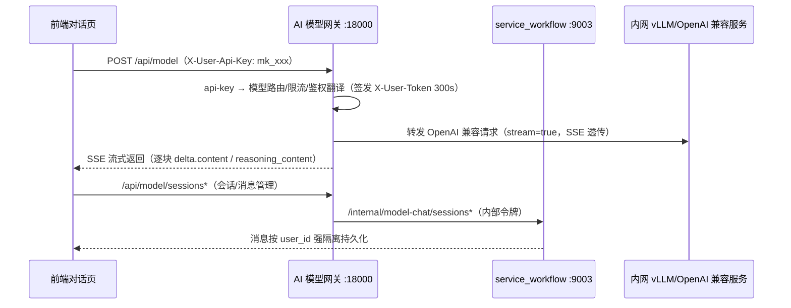

<p align="center">
  
  
  
  
  
  
  
</p>

<h1 align="center">🐉 DRAGON-AI · AI 中台</h1>

<p align="center">
  <b>企业级 LLM 应用开发与运营一体化平台</b><br/>
  <em>模型纳管 · 多模态对话 · RAG 知识库 · 工作流编排 · 智能体 · 全生命周期运营</em>
</p>

---

## 📖 项目背景

大模型技术快速落地的当下，企业内部普遍面临如下痛点：

- **模型分散**：多个内网推理服务（vLLM、DeepSeek、Qwen 等）各自维护地址与密钥，业务接入成本高、权限不可控；
- **缺乏统一治理**：没有集中的 API Key 发放/回收、调用限流、模型上下线管理手段；
- **应用构建断层**：从"模型可用"到"业务可用"之间缺少对话、知识库、工作流、智能体等应用层的统一支撑；
- **运营盲区**：谁在调用、调用了多少、来自哪个模块，缺乏可观测与审计能力。

**DRAGON-AI** 正是为解决上述问题而生：以 **AI 模型网关** 为统一入口，以 **微服务中台** 为底座，沉淀出「模型广场 → 模型网关 → 对话应用 → RAG 知识库 → 工作流/智能体 → 系统运营」的完整 LLM 应用全链路，帮助企业在**内网私有化**环境下低成本、规范化地建设自己的 AI 能力。

---

## ✨ 功能特性

### 1. 🗂️ 模型广场 —— 企业模型资产统一纳管

- **模型接入**：直连 / 非直连两种模式，非直连模型可按接口后缀（如 `/v1/chat/completions`）动态转发上游 OpenAI 兼容端点；
- **申请审批流**：用户申请模型 → 管理员审批 → 自动发放 API Key，全流程可审计；
- **一键连通性测试**：测试按钮实时展示 HTTP 状态、响应耗时与**上游完整返回报文**（格式化 JSON，不再截断）；
- **我的 API Key**：已授权密钥列表化展示，支持状态查看与回收；
- **动态上下线**：模型状态开关 + Redis 缓存刷新，秒级生效；
- **分类管理**：模型分类 / 维护内网部署地址（base_url）与鉴权密钥，MySQL 为唯一数据源，Redis 可重建缓存，定时对账保证最终一致。

### 2. 🌐 AI 模型网关 —— OpenAI 兼容统一入口（核心）

- **统一入口** `POST /api/model`，请求体与 OpenAI Chat Completions 完全兼容，`model` 字段驱动路由；
- **双轨鉴权**：外部模型调用走 `X-User-Api-Key: mk_xxx`，会话/消息管理走登录 JWT，互不干扰；
- **API Key 鉴权翻译**：api-key → 用户 → 短时效内部令牌（`X-User-Token`，300s），实现服务间身份安全传递；
- **三级限流保护**：模块级固定窗口限流 + 模型 QPS（双层 Hash 原子计数）+ 每日调用配额；
- **SSE 流式透传**：边读边吐，首 token 等待宽松（读超时 300s），长输出不断流；错误码智能映射（上游 429/5xx → 统一文案与状态）；
- **安全合规**：管理端密钥不在 Redis 明文存储，转发时回查加密 MySQL；全链路 `x-trace-id` 串联日志；
- **模型动态路由**：不同模型指向不同内网部署地址，支持流式/非流式、深度思考（`enable_thinking`）、联网搜索（`enable_search`）。

### 3. 💬 多模态对话 —— 开箱即用的模型对话应用

- **会话管理**：会话新建/重命名/删除/历史消息持久化，按 `user_id` 强隔离；
- **流式渲染**：SSE 逐块输出（含思考过程 `reasoning_content`），类 Markdown 即时渲染；
- **深度思考 / 联网搜索**：透传推理与搜索开关，直连与非直连模型均可使用；
- **失败透明**：调用失败时消息气泡内**默认展开「接口返回」面板**，完整展示网关返回体（`code/message/data`），异常一目了然；
- **链路追踪**：浏览器端自动携带 `x-trace-id`，请求串联后端全链路日志。

### 4. 📚 RAG 知识库 —— 企业私有知识问答基座

- **多格式文档接入**：PDF / Word / 文本等，单文档最大 50MB，状态机驱动（待处理 → 解析 → 向量化 → 完成）；
- **arq 异步任务**：工作流执行/恢复由独立 arq worker 进程消费（Redis 队列 db=1），API 秒回执行 ID；
- **混合检索**：BM25 关键词 + Milvus 向量召回 + **RRF 融合排序**，再经 **rerank / embed API 重排**，检索精度双保险；
- **向量存储**：每个知识库独立 Milvus 集合（`kb_{id}`）；
- **知识库问答**：对话页无缝挂载知识库（RAG 检索增强），回答可溯源。

### 5. 🔀 工作流编排 —— 可视化 AI 业务编排

- **可视化画布**：节点式流程编辑（LLM / 知识库 / 工具 / 条件分支等），拖拽即得；
- **调试面板**：流内逐步调试、运行历史回溯、模板市场一键导入；
- **MCP 与工具生态**：MCP 节点接入 + 工具中心（tool_router），沉淀企业级工具资产；
- **独立领域模型**：`domain` 层管理流程定义与执行状态，支持会话级上下文传递。

### 6. 🤖 智能体与技能中心 —— 自主规划与能力沉淀

- **自主智能体**：自研 ReAct 循环解析 `<tool>` / `<final>` 标记，自主规划-执行-反思；
- **子进程沙箱**：`python / shell / 技能` 均在隔离沙箱中执行，安全可控；
- **技能中心**：技能包（zip）安全解压至 `SKILL_SHARE_DIR`，目录即加载，随用随装（单包 ≤100MB）；
- **跨会话记忆**：`agent_memory` 集合做会话间记忆检索，连续任务更聪明。

### 7. 🛡️ 系统管理 —— RBAC 与全链路运营

- **RBAC 权限体系**：用户 / 角色 / 菜单 / 授权四层模型，权限点细粒度控制（如 `system:model:audit`）；
- **JWT 双因子登录态**：JWT 签名 + Redis `login:{jti}` 会话状态绑定，退出登录即时失效；
- **操作日志审计**：写操作异步落库 `tb_operate_log`，敏感字段（密码/token）自动脱敏；
- **在线用户监控**：实时查看在线会话；
- **限流配置中心**：按模块（登录/系统/知识库/模型网关…）在线配置限流窗口与阈值，发布即生效；
- **网关路由配置**：模型路由 / 限额 / 后缀能力在线维护。

### 8. 🚀 AI 全生命周期扩展

- **数据集（datasets）**：训练 / 评测数据统一管理；
- **模型训练（train）**、**模型推理（inference）**、**模型评测（eval_model）**、**Notebook**：微服务骨架与限流桶、网关路由均已预留，随业务扩展即插即用；
- **首页运营看板（statistics）**：核心指标可视化。

---

## 🏗️ 系统架构

```
┌──────────────────────────────────────────────────────────────────────┐
│                             浏览器（前端 :5666）                        │
│            Vue3 + vben v5 + ant-design-vue（模型广场/对话/系统管理…）     │
└────────────────────────────────────┬─────────────────────────────────┘
                                     │  /api/*（同源或 CORS 直连）
                                     ▼
┌──────────────────────────────────────────────────────────────────────┐
│                     AI 模型网关  service_gateway (:18000)              │
│   JWT 鉴权 · 限流（模块/模型QPS/日配额）· 操作日志 · x-trace-id 链路追踪    │
│   /api/model*  OpenAI 兼容统一入口（api-key → 鉴权翻译 → 动态路由转发）   │
└───────┬──────────┬──────────┬──────────┬──────────┬──────────────────┘
        │          │          │          │          │
        ▼          ▼          ▼          ▼          ▼
┌────────────┐ ┌──────────┐ ┌──────────┐ ┌──────────┐ ┌──────────────┐
│ 系统管理     │ │ 登录认证  │ │ RAG 知识库│ │ 工作流    │ │ 智能体/技能   │
│ :9001      │ │ :9044    │ │ :9002    │ │ :9003    │ │ :9005 / :9006│
│ 模型广场    │ │ 登录注册  │ │ 文档解析   │ │ 会话/消息  │ │ ReAct 智能体  │
│ RBAC/审计  │ │ 会话下发  │ │ 向量检索   │ │ 流程编排   │ │ 沙箱执行     │
└────────────┘ └──────────┘ └──────────┘ └──────────┘ └──────────────┘
        │          │          │          │          │
        ▼          ▼          ▼          ▼          ▼
┌──────────────────────────────────────────────────────────────────────┐
│           基础设施：Nacos（注册/配置）· MySQL（业务数据）· Redis 7.4+     │
│           · Milvus（向量库）· arq（异步任务队列）· 内网 vLLM/推理服务      │
└──────────────────────────────────────────────────────────────────────┘
```

**模型对话全链路**（网关无状态代理设计）：



---

## 🧰 技术栈

| 层 | 技术 | 说明 |
|---|---|---|
| 后端框架 | Python 3.11 + FastAPI 0.104+ | 异步 Web 微服务框架 |
| ORM | SQLAlchemy 2.0（asyncio）+ Alembic | 全异步数据库层，纯 ORM 编码 |
| 网关 | service_gateway（自研） | 统一鉴权 / 限流 / 动态转发 / SSE 透传 |
| 注册配置 | Nacos（nacos-sdk-python） | 服务注册发现 + 配置中心，注册即路由 |
| 数据存储 | MySQL（aiomysql）+ Redis 7.4+ | 业务数据 / 会话态·限流计数·路由缓存 |
| 向量检索 | Milvus + BM25 + RRF 融合 + rerank | 知识库混合检索 |
| 异步任务 | arq 0.28（Redis 队列，db=1） | 工作流执行/恢复（worker 独立进程） |
| HTTP 客户端 | httpx（连接池 keep-alive + HTTP/2） | 服务间调用 / 网关上游转发 |
| 日志可观测 | loguru + OpenTelemetry + 自研 trace-id | 结构化日志与全链路串联 |
| 前端框架 | Vue 3.5 + TypeScript 5.9 + Vite | vben v5（pnpm/turbo monorepo） |
| UI 组件 | ant-design-vue 4.x + fast-crud | 中后台组件与 CRUD 方案 |
| 鉴权 | JWT（python-jose）+ Redis 登录态 + api-key 双轨 | 平台会话 / 模型调用双通道 |

---

## 📁 目录结构

```
python-microsoft-fast
├── common/                        # 公共层（所有服务共享）
│   ├── common_app/                #   FastAPI 统一引导工厂（CORS/日志/鉴权/限流中间件）
│   ├── common_middleware/         #   RequestLog / TokenCheck / RateLimit / OperateLog
│   ├── common_nacos/              #   Nacos 注册发现与配置拉取
│   ├── common_redis/              #   异步 Redis 客户端（Lua 原子计数）
│   ├── common_mysql/              #   异步 SQLAlchemy 会话工厂
│   ├── common_milvus/             #   Milvus 向量客户端
│   ├── common_httpx/              #   全局连接池（keep-alive）
│   ├── common_permission/         #   RBAC 权限装饰器
│   └── common_entity/             #   统一响应体 ApiResponse / 实体
├── service/                       # 业务微服务（每服务独立端口）
│   ├── service_gateway/           #   AI 模型网关 :18000（路由/鉴权/限流/SSE）
│   ├── service_system/            #   系统管理 + 模型广场 :9001
│   ├── service_rag/               #   RAG 知识库 :9002
│   ├── service_workflow/          #   工作流 + 会话管理 :9003
│   ├── service_login/             #   登录认证 :9044
│   ├── service_agent/             #   智能体 :9005
│   ├── service_skill/             #   技能中心 :9006
│   └── service_* /                #   数据集 / 训练 / 推理 / 评测 / Notebook（预留）
├── arq_tasks/                      # arq 任务（worker 配置 + 工作流执行/恢复任务）
├── common/common_arq/              # arq 生产端封装（投递任务）
├── ui-ai/                         # 前端（vben v5 monorepo）
│   └── apps/web-antd/             #   Web 端应用 :5666
│       └── src/views/wemirr/      #   模型广场 / 对话 / 知识库 / 工作流 / 智能体 / 系统管理
├── docker/  k8s/                  # 容器化与编排
└── docs/                          # 文档（接口规范等）
```

---

## 🚀 快速开始

### 环境要求

| 依赖 | 版本要求 | 说明 |
|---|---|---|
| Python | 3.11+ | 后端运行环境 |
| Node.js | 20+ / 22+ | 前端构建环境（本仓库实测 22.x） |
| pnpm | 9+ | 前端包管理（workspace monorepo） |
| MySQL | 8.x | 业务数据库 |
| Redis | 7.4+ | 登录态 / 限流 / 模型路由缓存（需字段级过期能力） |
| Nacos | 2.x | 注册中心 + 配置中心 |
| Milvus | 2.x | 知识库向量检索 |
| 模型服务 | vLLM 等 | OpenAI 兼容内网推理端点 |

### 1. 初始化基础设施

按上文要求部署 MySQL / Redis / Nacos / Milvus，并准备至少一个 OpenAI 兼容的模型推理端点。

### 2. 启动后端微服务

```bash
# 创建虚拟环境并安装依赖
python -m venv .venv
.venv\Scripts\activate            # Windows
pip install -r requirements.txt

# 逐服务启动（worker=2，自动注册 Nacos）
python -m service.service_gateway.gateway    # AI 模型网关 :18000
python -m service.service_login.login        # 登录认证   :9044
python -m service.service_system.system      # 系统管理   :9001
python -m service.service_rag.rag            # RAG 知识库 :9002
python -m service.service_workflow.workflow  # 工作流     :9003
python -m arq_tasks.run_workers -n 4    # 4 个 arq worker（工作流执行，Redis db=1）
```

> 服务启动时自动向 Nacos 注册并拉取各自配置（数据源、Redis、模型路由等）。

### 3. 启动前端

```bash
cd ui-ai
pnpm install
pnpm dev:antd        # Vite dev server :5666
```

浏览器访问 `http://127.0.0.1:5666`，初始账号 `admin / Admin@123`（首次登录后请修改）。

> 开发模式默认通过 Vite 代理转发 `/api` 至网关；如需浏览器直连网关（Network 直接显示网关地址），将 `apps/web-antd/.env.development` 中 `VITE_GLOB_API_URL` 改为 `http://<网关IP>:18000` 并重启前端（网关已全放行 CORS）。

### 4. 快速体验链路

1. 进入 **模型广场**，申请一个模型密钥（或由管理员审批发放）；
2. 在 **模型广场 → 对话** 中选择模型发起对话，体验流式输出 / 深度思考；
3. 在 **系统管理** 中配置模型路由、限流策略，查看操作日志与在线用户；
4. 在 **知识库** 上传文档，完成向量化后到对话页挂载知识库提问。

---

## 📚 相关文档

- [模型接口规范](docs/model-interface-schema.md)（`/api/model` OpenAPI 兼容出入参、错误码约定）

---

## 📄 开源许可

本项目基于 **Apache License 2.0** 开源（`LICENSE`）。商用前请确认模型与数据使用合规。

---

<p align="center">
  Made with ❤️ by DRAGON-AI Team — 让大模型在企业内网高效、安全、可控地创造价值
</p>